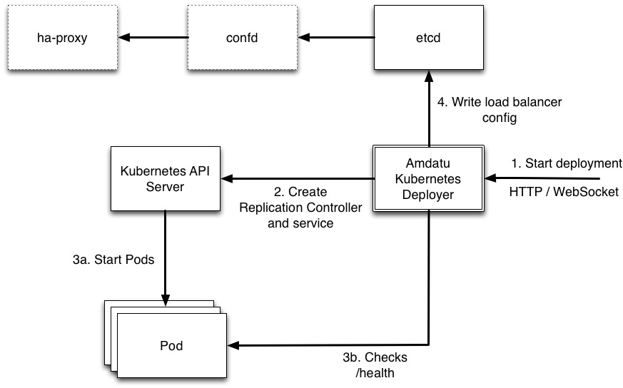

# Introduction

Amdatu Kubernetes Deployer is a component to orchestrate Kubernetes deployments with the following features:

* Blue-green deployment
* External load balancer configuration
* Management of deployment descriptors
* Management of actual deployments
* Health checks during deployment
* Injecting environment variables into pods

The component is built on top of the Kubernetes API.
It provides a REST API for management of descriptors and deployments, and a Websocket API for streaming logs during a deployment.

The Amdatu Kubernetes Deployer is typically used together with the Amdatu Kubernetes Deploymentctl UI, or invoked as part of a build pipeline.

Amdatu Kubernetes Deployer is used in several production environments, and is actively maintained.



# Related components

There are several related Amdatu components that work very well together, but are loosely coupled.

* Amdatu Kubernetes Deploymentctl is a UI for the Amdatu Kubernetes Deployer
* Amdatu Ha-proxy confd is a configuration template to use Ha-proxy together with Kubernetes and the Amdatu Kubernetes Deployer.

# Load balancing

To make applications available to the internet, a load balancer is used in front of Kubernetes.
Although Kubernetes has some primitives (Service & Ingress) built in for load balancing, it is currently not very useful if you're not running on a supported cloud environment.  
Amdatu Kubernetes Deployer is designed to work with different load balancers, and uses etcd for load balancer configuration.  
Based on this configuration in etcd a tool like [confd](https://github.com/kelseyhightower/confd) can be used to generate configuration for a load balancer.  
Amdatu Ha-proxy confd provides out-of-the-box support for Ha-proxy, and can be used as an example for integrating other load balancers.  

The configuration schema is defined [here](proxy-config.md).

# Usage

## Running

Run as a Docker container:

```
docker run amdatu/amdatu-kubernetes-deployer:production -kubernetes http://[kubernetes-api-server]:8080 -etcd http://[etcd-server]:2379
docker run amdatu/haproxy-confd:prod ...
```

## Deployment descriptors

### Schema

The following JSON represents a deployment descriptor, which describes how to deploy your application:

```
{
    "id": "<unique id>",                       // will be set by deployer when creating a new descriptor
    "created": "2017-01-15T02:02:14Z",         // creation timestamp, set by deployer
    "lastModified": "2017-02-08T08:54:01Z"`    // modification timestamp, set by deployer
    "deploymentType": "blue-green",            // rollout strategy, optional, defaults to blue-green, the only supported type atm
    "namespace": "default",                    // k8s namespace, required
    "appName": "my-app",                       // the name of your app, required, must comply to https://github.com/kubernetes/community/blob/master/contributors/design-proposals/identifiers.md
    "newVersion": "#",                         // version, use "#" for an autoincrement (on each deployment) number
    "imagePullSecrets" : [                     // secrets for private docker repository credentials, optional
        {
            "name": "secretName"               // name of the secret holding the credentials
        }
    ]
    "replicas": 2,                             // number of pods which should be started, optional, defaults to 1
    "frontend": "example.com",                 // domain for the proxy config, optional (if not set, the proxy will not be configured for this app)
    "redirectWww": "<boolean>"                 // if true the "www" subdomain will be redirected automatically to given frontend domain, defaults to false
    "useCompression": "<boolean>"              // if true gzip compression will be enabled, defaults to false
    "additionHttpHeaders": [                   // http headers, which should be set by proxy on every response, optional
        {
            "Header": "X-TEST",
            "Value": "some http header test"
        }
    ],
    "useHealthCheck": true,                    // whether the app supports health checks
    "healthCheckPort": 9999,                   // the healthcheck port, required if "useHealthCheck" is true
    "healthCheckPath": "health",               // the healthcheck path, required if "useHealthCheck" is true
    "healthCheckType": "probe|simple",         // the healthcheck type, see below, required if "useHealthCheck" is true
    "ignoreHealthCheck": true,                 // whether to ignore the healthcheck during deployments (healthcheck still might be used by other monitoring tools)
    "webhooks": [                              // webhook identifier(s) for automated redeployments, not used by deployer, but deploymentctl
        {
            "key": "<unique id>",              // required
            "description": "..."               // optional, for your own usage
        }
    ],
    "podspec": {
        ...                                    // the K8s PodSpec as in http://kubernetes.io/docs/api-reference/v1/definitions/#_v1_podspec
    }
}
```

### Health checks

Health checks should be implemented as part of the application. They help the deployer (and potentially other tools) to determine when and if your
application is started and healthy.
When health checks are enabled, the Amdatu Kubernetes Deployer expects them on `<healthCheckPath>` in the first container in the pod.
When multiple ports are configured in the container, the health check port should be named `healthcheck`.
If no ports are configured in on container, port 9999 is assumed. (Note: since this "algorithm" is confusing, there will probably a change on this in the near future...)

There are two healthcheck types, `probe` and `simple`:

1. `probe`:  
The healthcheck endpoint should return JSON in the following format:  
    `{ "healthy" : true|false }`  
Additional properties are allowed, but ignored by the Amdatu Kubernetes Deployer.

2. `simple`:
The healthcheck endpoint should return a 2xx status code for healthy apps, anything else if unhealthy.

### Manage descriptors

The deployer offers a REST API for creating, updating and deleting desciptors:

| Resource | Method | Description |Returns |  
|---|---|---|---|
|/descriptors/?namespace={namespace}|POST|Create new deployment descriptor, JSON formatted descriptor in the POST body<br>no deployment is triggered|201 with Location header pointing to new descriptor<br>401 not authenticated<br>403 no access to namespace<br>400 bad request (malformed deployment descriptor)
|/descriptors/?namespace={namespace}[&appname={appname}]|GET|Get all descriptors<br>optionally provide additional appname filter|200 with list of descriptors, can be empty<br>401 not authenticated<br>403 no access to namespace
|/descriptors/{id}/?namespace={namespace}|GET|Get descriptor with given id|200 with descriptor<br>401 not authenticated<br>403 no access to namespace<br>404 descriptor not found|  
|/descriptors/{id}/?namespace={namespace}|PUT|Update descriptor, JSON formatted descriptor in the POST body<br>no (re-)deployment is triggered|204 success no content<br>401 not authenticated<br>403 no access to namespace<br>404 descriptor not found
|/descriptors/{id}/?namespace={namespace}|DELETE|Delete descriptor<br>no undeployment is triggered|200 success no content<br>401 not authenticated<br>403 no access to namespace<br>404 descriptor not found

## Deployments

### Schema

Based on an existing descriptor you can start a deployment. That will create a deployment resource in this format:
 
```
{
    "id": "<unique id>",                                              // will be set by deployer during deployment
    "created": "2017-01-15T02:02:14Z",                                // creation timestamp, set by deployer
    "lastModified": "2017-02-08T08:54:01Z"                            // modification timestamp, set by deployer
    "version": "<version>",                                           // deployment version, set by deployer based on descriptor's version field
    "status": "DEPLOYING|DEPLOYED|UNDEPLOYING|UNDEPLOYED|FAILURE",    // deployment status, set by deployer
    "descriptor": {                                                   // a copy(!) of the descriptor used for the deployment 
        ...
    }
}
```

### Deploying

The deployer offers a REST API for deploying apps based on the deployment descriptor, and for getting logs and healthcheck data: 

| Resource | Method | Description |Returns |  
|---|---|---|---|
|/deployments/?namespace={namespace}<br>&descriptorId={descriptorId}|POST|Trigger a deployment<br>will create a deployment resource<br>you can poll the created deployment resource for the current status, logs and healthcheck data|202 deployment started, with Location header pointing to deployment<br>401 not authenticated<br>403 no access to namespace<br>404 descriptor not found
|/deployments/?namespace={namespace}<br>[&appname={appname}]|GET|Get all deployments<br>optionally provide appname filter|200 with list of descriptors, can be empty<br>401 not authenticated<br>403 no access to namespace (with filter only)
|/deployments/{id}/?namespace={namespace}|GET|Get deployment|200 deployment resource found (check deployment status if (un-)deployment is running / was successfull)<br>401 not authenticated<br>403 no access to namespace<br>404 deployment not found
|/deployments/{id}/logs?namespace={namespace}|GET|Get deployment logs<br>logs are updated constantly during (un)deployments|200 deployment logs found<br>401 not authenticated<br>403 no access to namespace<br>404 deployment not found
|/deployments/{id}/healthcheckdata?namespace={namespace}|GET|Get deployment healthcheckdata<br>healthcheckdata is updated at the end of a deployment|200 deployment healthcheckdata found<br>401 not authenticated<br>403 no access to namespace<br>404 deployment not found
|/deployments/{id}/?namespace={namespace}|PUT|Redeploy this deployment<br>empty body|202 redeployment started, with Location header pointing to new deployment<br>401 not authenticated<br>403 no access to namespace<br>404 deployment not found
|/deployments/{id}/?namespace={namespace}<br>[&deleteDeployment={true&#124;false}]|DELETE|Trigger a undeployment and / or deletion of the deployment resource<br>if the deployment is deployed, it will be undeployed.<br>Poll deployment for status until it returns a UNDEPLOYED<br>if deleteDeployment is true, also the deployment resource itself will be deleted, and polling it will result in a 404 when undeployment and deletion is done|202 undeployment started<br>401 not authenticated<br>403 no access to namespace<br>404 deployment not found

### Used K8s resources

For each deployment the following resources are created in Kubernetes.

|Resource | Name | Description   |
|---|---|---|
|service   |appName| Service that is *not* versioned. This service can be used from other components, because it stays around between deployments. |
|service   |appName-version| Service that is versioned. This service is used by the load balancer. Each deployment will create a new service |
|replication controller   |appName-version| Replication controller for the specific version of the deployment. Each deployment will create a new replication controller|

## Environment variables

It's possible to inject extra environment variables into pods, which are not defined in the deployment descriptor.
This is useful if pods need to discover certain infrastructure services outside Kubernetes, without the need to put them in the deployment descriptor.
To inject an environment variable, a key has to be created in etcd:

```
/deployer/environment/[mykey]
```

The key will be the environment variable name, the value of the etcd key will be the value of the environment variable.

# Authentication and authorization

For authentication against the Kubernetes API, basic authentication is supported.
Credentials need to be provided as program arguments.

Authentication and authorization for the REST API is not implemented yet, but will be based on JWT, like it is already done in DeploymentCtl.

# Getting involved


[Bug reports and feature requests](https://amdatu.atlassian.net/projects/AKD) and of course pull requests are greatly appreciated!  
The deployer is built using Bitbucket Pipelines (see `bitbucket-pipelines.yml` and `build.sh`), which results in executables
which can be downloaded on the [Bitbucket Download Section](https://bitbucket.org/amdatulabs/amdatu-kubernetes-deployer/downloads/),  
and in Docker images, see [Docker Hub](https://hub.docker.com/r/amdatu/amdatu-kubernetes-deployer).

# Versioning

The binaries are named and the docker images are tagged using a alpha/beta/production scheme:

- Every push to master result in a `alpha` version and a version with the current git hash.
- Every git tag results in a version with the same name, reusing the already build git hash based artifacts from the `alpha` step.
We use `beta` and `production` tags, which will be moved for every new beta/production version.
- For the `production` tag there will also be an additional tag, which represents a version number, following semantic versioning scheme, which will not be moved.
- On docker hub the `production` tag will also result in the `latest` tag

# Dependency management

This repository uses [Godep](https://github.com/tools/godep) for go dependency management. In short this means:

- Install Godep:
    - Run `go get github.com/tools/godep`

- Add a new dependency:
    1. Run `go get foo/bar`
    1. Use new dependency
    1. Run `godep save ./...`

- Update an existing dependency:
    1. Run `go get -u foo/bar`
    1. Run `godep update foo/bar`